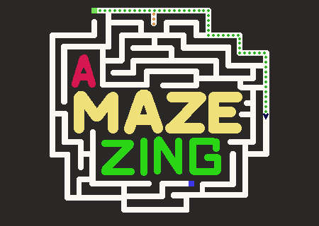
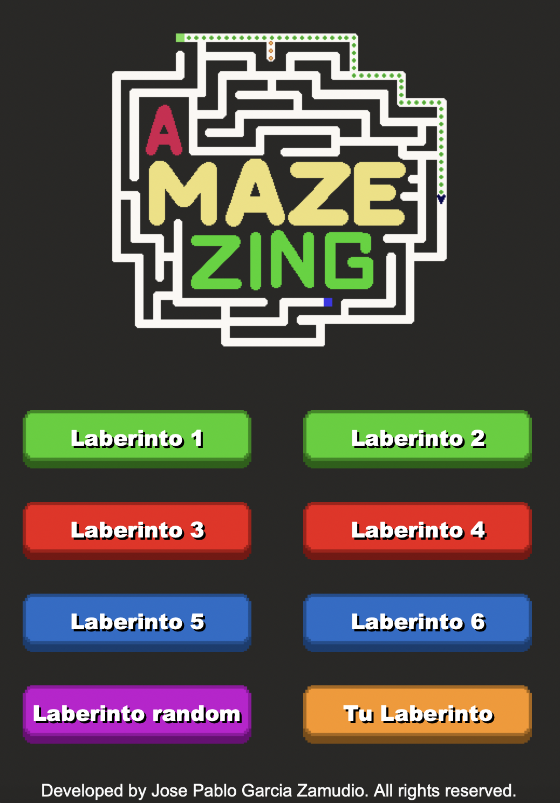
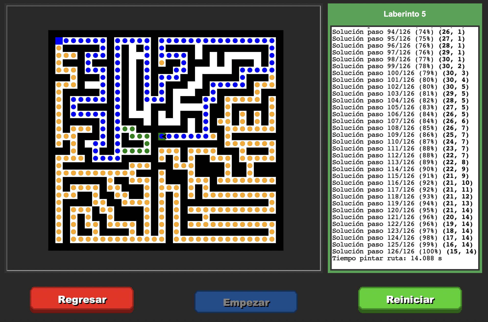
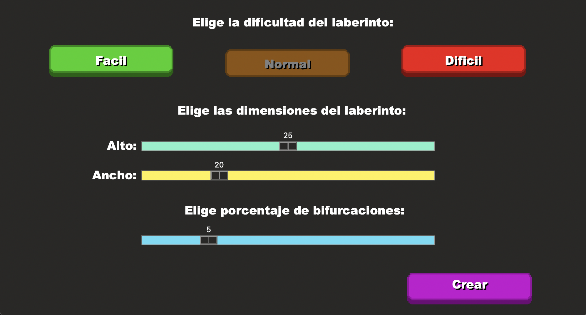
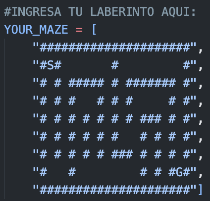

<div align="center">



# 🐢 A-MAZE-ZING

### A Python desktop application that visualizes maze solving using Recursive Backtracking


*Watch every decision, dead end, and backtrack as the algorithm searches for the exit.*

</div>

---

# 📖 About

**A-MAZE-ZING** is an educational Python project that demonstrates how **Recursive Backtracking** explores a maze in real time. Instead of instantly showing the solution, the application animates every movement, wrong turn, and backtrack performed by the algorithm.

Once the goal is reached, the program computes the **shortest possible path** using **Breadth-First Search (BFS)**, allowing users to compare the exploration process with the optimal solution.

The application also includes built-in mazes, procedural maze generation, custom maze support, and detailed statistics about every execution.

---

# 🏠 Main Menu

The main menu lets you choose how you want to explore the project.

Features include:

- 🗺️ Six handcrafted mazes
- 🎲 Random maze generator
- ✏️ Import your own maze
- 👀 Live maze previews when hovering over built-in mazes
- 🎨 Animated custom buttons

<p align="center">
  
</p>

---

# 🐢 Maze Visualization

After selecting a maze, the visualization window opens.

The maze is drawn using **Python Turtle**, while a recursive backtracking algorithm explores every possible path.

Color coding makes the execution easy to follow:

- 🟢 Current exploration
- 🟠 Dead ends and backtracking
- 🔵 Final optimal path
- ⚫ Walls
- ⚪ Free cells

A statistics panel updates while the algorithm is running, making it easy to understand exactly what is happening internally.

<p align="center">
  
</p>

---

# 🎲 Random Maze Generator

Generate unique mazes every time the program runs.

The generator allows you to customize:

- Difficulty
- Maze width
- Maze height
- Number of branches

Every generated maze is guaranteed to be solvable and can immediately be visualized inside the application.

<p align="center">
  
</p>

---

# ✏️ Create Your Own Maze

The project also supports completely custom mazes.

Simply edit **maps.py** and replace the `YOUR_MAZE` variable with your own layout.

Supported symbols:

- `"#"` Wall
- `" "` Empty path
- `"S"` Start
- `"G"` Goal

This makes it easy to test your own maze designs without modifying the main application.

<p align="center">
  
</p>

---

# 📊 Maze Information

During execution the application displays useful information, including:

- Maze dimensions
- Total cells
- Wall density
- Start and goal coordinates
- Number of branches
- Visited nodes
- Search time
- Optimal path length
- Complete shortest-path coordinates

This transforms the project into a useful educational tool rather than a simple maze solver.

---

# 🧠 Algorithms Used

| Algorithm | Purpose |
| :--- | :--- |
| **Recursive Backtracking** | Explores the maze recursively until the goal is found |
| **Breadth-First Search (BFS)** | Computes the shortest path after exploration |
| **Randomized Depth-First Search (DFS)** | Generates procedural mazes |

---

# ✨ Features

- 🐢 Real-time Turtle animation
- 🎮 Interactive Tkinter interface
- 🧠 Recursive Backtracking visualization
- 📍 Shortest path calculation with BFS
- 📊 Live maze statistics
- 🎲 Procedural maze generation
- ✏️ Custom maze support
- 🎨 Animated custom buttons
- 👀 Maze preview system
- ⚡ Smooth visualization

---

# 📂 Folder Structure

```text
📦 A-MAZE-ZING
│
├── main.py
├── maps.py
│
├── Assets/
│   ├── Buttons/
│   ├── Preview/
│   ├── Icons/
│   └── ...
```
---

### `main.py`

Contains the graphical interface, maze rendering, animation, recursive backtracking implementation, BFS shortest-path calculation, and all user interactions.

---

### `maps.py`

Contains all predefined mazes, custom maze support, and the procedural random maze generator.

---

### `Assets/`

Stores images, logos, button sprites, maze previews, and other graphical resources used throughout the application.

---

> **💡 Note**
>
> Keep the project structure unchanged, since the application loads assets using relative paths.

---

# 🛠 Requirements

- Python **3.11+**
- Tkinter *(included with most Python installations)*
- Turtle *(included with most Python installations)*

No additional libraries are required.

---

# 🚀 Getting Started

Clone the repository:

```bash
git clone https://github.com/jpablo-gz/A-MAZE-ZING.git
```

Go into the project:

```bash
cd A-MAZE-ZING
```

Run the application:

```bash
python main.py
```

---

<div align="center">
  
Made with ❤️ using **Python**, **Tkinter**, and **Python Turtle**

</div>

